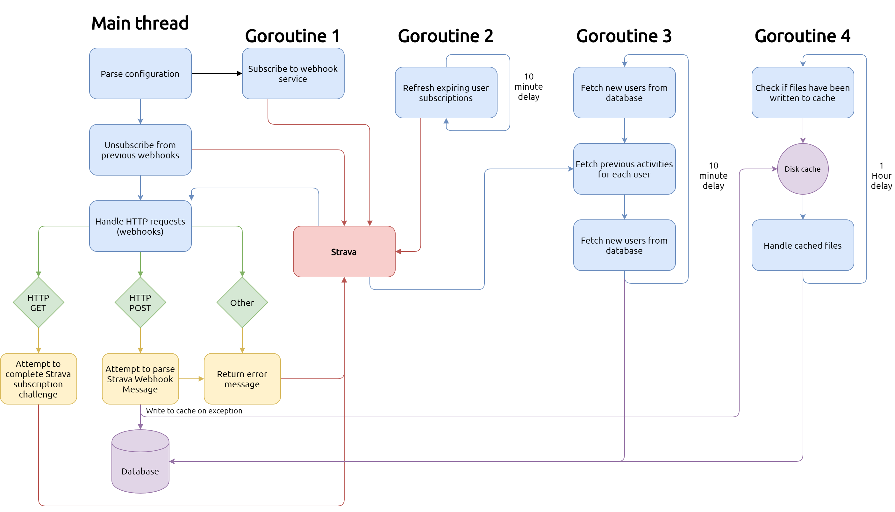

# go-strava-daemon

<p align="center">
  <a href="https://github.com/bikedataproject/go-strava-daemon">
    
  </a>

  <h3 align="center">Go Strava Daemon</h3>

  <p align="center">
    This projects'goals is to fetch Strava user data via a webhook subscription to Strava.
    <br />
    <a href="https://github.com/bikedataproject/go-strava-daemon/issues">Report Bug</a>
    ·
    <a href="https://github.com/bikedataproject/go-strava-daemon/issues">Request Feature</a>
  </p>
</p>


 

## About this repository

This repository contains a daemon service to fetch Strava user data. This service is exposed to the internet with 1 single endpoint, which goal is to receive Webhook messages from Strava. These Webhook messages have information about new user activities, which will be fetched and stored in the database.

## Required parameters

This daemon requires some `ENV` variables to be set. Below is an example:

```sh
export CONFIG_DEPLOYMENTTYPE="testing"
export CONFIG_POSTGRESHOST="localhost"
export CONFIG_POSTGRESPORT="5432"
export CONFIG_POSTGRESPASSWORD="MyPostgresPassword"
export CONFIG_POSTGRESUSER="postgres"
export CONFIG_POSTGRESDB="bikedata"
export CONFIG_POSTGRESREQUIRESSL="require"
export CONFIG_STRAVACLIENTID="MY_STRAVA_ID"
export CONFIG_STRAVACLIENTSECRET="MY_STRAVA_SECRET"
export CONFIG_CALLBACKURL="https://redirect-to-me.com"
export CONFIG_STRAVAWEBHOOKURL="https://www.strava.com/api/v3/push_subscriptions"
```

## How to run: use the official image

```sh
docker pull bikedataproject/go-strava-daemon:staging

docker run -d -p 4000:4000 \
-e CONFIG_POSTGRESHOST="localhost" \
-e CONFIG_POSTGRESPORT="5432" \
-e CONFIG_POSTGRESPASSWORD="MyPostgresPassword" \
-e CONFIG_POSTGRESUSER="postgres" \
-e CONFIG_POSTGRESDB="bikedata" \
-e CONFIG_POSTGRESREQUIRESSL="require" \
-e CONFIG_STRAVACLIENTID="MY_STRAVA_ID" \
-e CONFIG_STRAVACLIENTSECRET="MY_STRAVA_SECRET" \
-e CONFIG_CALLBACKURL="https://redirect-to-me.com" \
-e CONFIG_STRAVAWEBHOOKURL="https://www.strava.com/api/v3/push_subscriptions" \
bikedataproject/go-strava-daemon:staging
```

## Flow diagram


